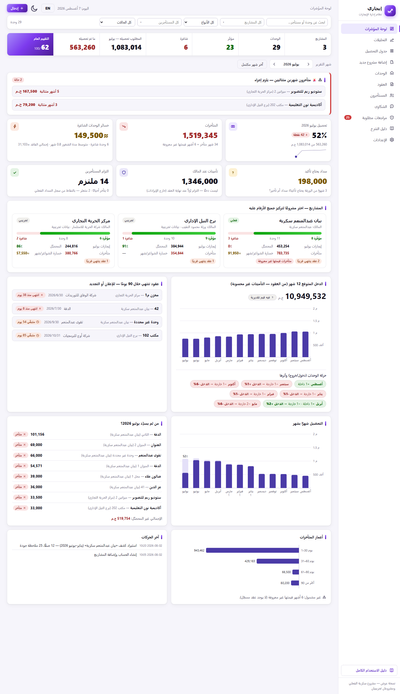
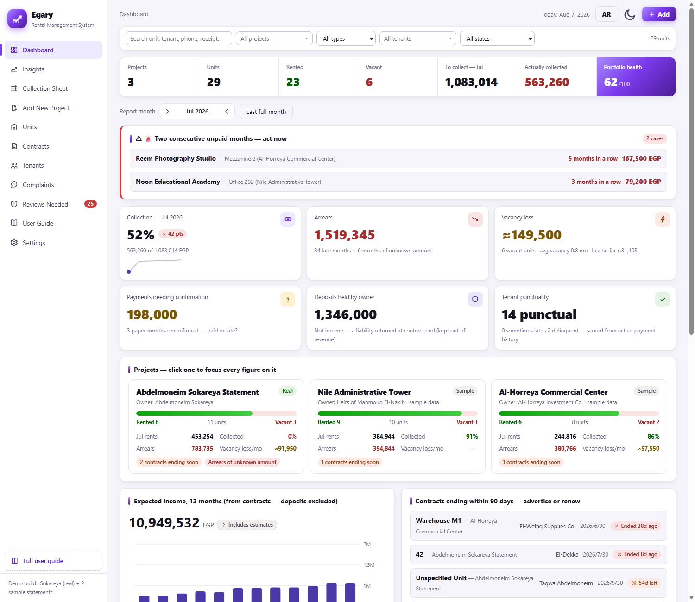
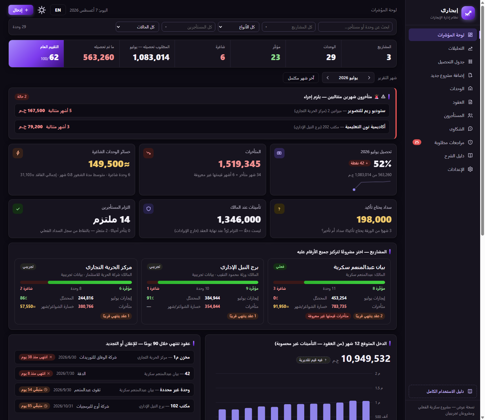

# Egary (إيجاري) — Rental Management System

> Simple, clear, and zero-dependency.

Turn paper rent statements into a live digital portfolio: collections, aged arrears, contracts & renewals, complaints, and a built-in data-quality workflow — in a single static web app with **zero dependencies**.

<p align="center">
  
</p>

## Why

Property offices receive handwritten rent statements: a grid of tenants × months with ✓/✗ marks, contract dates, and yearly rent values. The paper says *"a payment happened"* — never **how much, when, or what remains**, and it can't tell *"late"* from *"forgot to write it down."*

Egary ingests each paper as an independent **statement**, keeps every ambiguity as an explicit open question, and computes every figure live from contracts and payments — nothing is ever typed into a KPI.

## Features

- **Top-down Dashboard** — portfolio strip (projects / units / rented / vacant / to-collect / collected / a 0-100 **health score**), per-project cards with rented-vs-vacant bars and vacancy loss, a red **two-consecutive-unpaid-months alarm**, move-in/move-out forecast with income impact %, contracts-ending-in-90-days action list, aged arrears, and a direct *"Who has not paid?"* list. Every card clicks through to the exact filtered view.
- **Collection Matrix** — the paper grid, alive. Two modes: *record payments* (click a cell → full payment with amount, date, method, receipt) and *transcribe paper* (click cycles ✓ → ✗ → blank). Bulk-collect an entire month in one dialog.
- **Statement Intake** — a 3-step wizard that turns any incoming paper into a working statement: owner → rows (unit + tenant + contract with auto-generated year schedule) → month marks.
- **Insights** — auto-written findings (arrears concentration, revenue cliff, vacancy loss estimate, best/worst statement), 12-month collection trend, top debtors, tenant punctuality scores, rent averages by unit type.
- **Contracts timeline** — a priority-sorted Gantt: ended-without-renewal first, "X days left" badges, renewal chains, monthly rent inside each bar.
- **Data Quality** — every contradiction in the source paper becomes a tracked question with the literal source text, the interpretation taken, and a recorded owner resolution.
- **Complaints log** with category, cost, and who bears it.
- **Fully bilingual** — Arabic RTL and complete English LTR, switchable live (`EN` button or `?lang=en`).
- **Dark mode** — full theme including the charts (`🌙` button or `?theme=dark`).
- **Mobile responsive**, keyboard accessible, Arabic-normalized search (hamza/ta-marbuta/Hindi digits) across tenants, units, owners, phones, and receipt numbers.
- **CSV exports** (arrears, matrix, contracts, payments) that open cleanly in Excel.

<p align="center">
  
  
</p>

## Quick start

No build, no server, no dependencies:

```
open app/index.html        # or just double-click it
```

Works from `file://` or any static host. To share with a non-technical person, send them the single self-contained `Egary.html`.

### Deploy

The repo ships with `vercel.json` — import it on [Vercel](https://vercel.com/new) (or any static host; GitHub Pages works too). The root URL serves the app; `/docs` serves the user guide.

## Documentation

**[docs/index.html](docs/index.html)** — a full screenshot-based user guide (Arabic): every screen and every card explained — what it is, where its number comes from, how it's computed, and how to use it. Written as a handover document.

## Architecture

```
app/
├── index.html
├── css/app.css        design system: light/dark themes, RTL/LTR
└── js/
    ├── seed.js        real statement data + 2 sample statements + quality log
    ├── store.js       dues engine & BI aggregations, localStorage persistence
    ├── i18n-content.js + i18n.js   complete English layer (zero-Arabic verified)
    ├── ui.js          DOM helpers, drawers, normalized Arabic search
    ├── charts.js      hand-rolled theme-aware SVG charts
    ├── views.js       all screens
    └── app.js         shell & routing
docs/                  screenshot-based user guide
Egary.html             single-file build for easy sharing
```

Plain ES5+ JavaScript, no frameworks, no external requests. State persists in `localStorage` (demo build); a production deployment swaps the storage layer for a server with auth and an audit trail — the UI stays the same.

## Design principles

1. **State is computed, never typed** — "late" is the result of comparing dues to payments after the due day + grace, not a field someone fills.
2. **Confirmed-late ≠ undocumented** — paper can't tell them apart; the system refuses to guess.
3. **Rent follows the contract year**, not the calendar year — split months are prorated by day.
4. **A renewal is a new contract** linked to its predecessor — history is never edited away.
5. **Every assumption is declared** and every source ambiguity is a tracked question with a recorded resolution.
